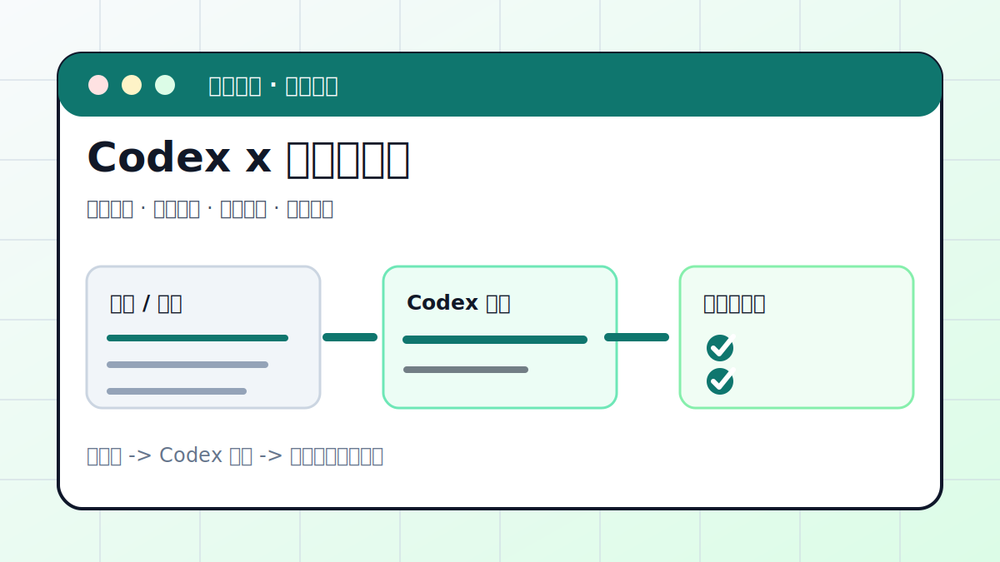

# Codex × 高校辅导员：名单、统计、材料、通知一把梭



## 案例目标

把辅导员每天最耗时间的杂活——整理名单、统计人数、写总结材料、发通知收回复——交给 Codex。

**最终产出**：规范名单、统计表、可直接报送的总结材料、通知 + 接龙汇总。

## 适合谁

高校辅导员、班主任、学生干部。**不需要任何编程基础**，会用电脑文件夹就行。

## 怎么用这篇

下面每一步都长一个样：**先说想做什么 → 给你一段可以直接复制的提示词 → 告诉你 Codex 大概会输出什么**。照着复制、改成你自己的文件名即可。

> 开始前：新建一个文件夹（比如 `带班工作`），把你的 `学生名单.xlsx`、工作记录放进去，然后让 Codex 在这个文件夹里工作。

---

## 步骤 1：把乱七八糟的名单整理成规范表格

**想做的事**：一份列名混乱、有重复的名单，整理成统一格式。

**复制这段发给 Codex：**

```text
我有一个 学生名单.xlsx，列很乱。请帮我整理成统一表格：
列依次为 学号、姓名、专业、班级、宿舍、联系电话；
去掉完全重复的行；先按专业、再按宿舍排序；
结果另存为「整理后/名单-规范版.xlsx」，不要改原文件。
```

**Codex 会给你（示例）：**

> 已生成 `整理后/名单-规范版.xlsx`，共 128 人，删除重复 3 条，已按专业 + 宿舍排序。
>
> | 学号 | 姓名 | 专业 | 班级 | 宿舍 | 联系电话 |
> | --- | --- | --- | --- | --- | --- |
> | 20230101 | 张三 | 软件工程 | 2301 | 7-201 | 138\*\*\*\*1234 |
> | 20230102 | 李四 | 软件工程 | 2301 | 7-201 | 139\*\*\*\*5678 |
> | … | | | | | |

---

## 步骤 2：一键统计分组（人数 / 占比）

**想做的事**：按专业、宿舍楼统计人数，找出最多和最少。

**复制这段发给 Codex：**

```text
根据「整理后/名单-规范版.xlsx」，
统计每个专业的人数和占比，再统计每栋宿舍楼的人数，
用表格展示，并指出人数最多和最少的专业。
```

**Codex 会给你（示例）：**

> | 专业 | 人数 | 占比 |
> | --- | --- | --- |
> | 软件工程 | 52 | 40.6% |
> | 网络工程 | 41 | 32.0% |
> | 信息安全 | 35 | 27.4% |
>
> 人数最多：软件工程（52 人）；最少：信息安全（35 人）。宿舍主要集中在 7 栋和 9 栋。

---

## 步骤 3：根据工作记录自动写总结材料

**想做的事**：把零散的工作记录变成一份能报送学院的正式总结。

**复制这段发给 Codex：**

```text
我把这个月的工作记录放在「本月台账.md」里。
请据此写一份 800 字左右的「主题班会工作总结」，
语气正式、可直接报送学院，分为
开展情况、学生反馈、存在问题、下一步计划 四个部分。
```

**Codex 会给你（示例）：**

> **主题班会工作总结（2026 年 6 月）**
>
> **一、开展情况**　本月围绕"诚信考试"主题召开班会 2 次，覆盖全班 128 人，到课率 98%……
>
> **二、学生反馈**　多数同学反映……
>
> **三、存在问题**　个别同学考前焦虑明显……
>
> **四、下一步计划**　拟于下月开展一对一谈心……

---

## 步骤 4：起草通知 + 自动生成接龙模板

**想做的事**：写一条正式通知，并附一个让学生回复的接龙模板。

**复制这段发给 Codex：**

```text
帮我写一条面向全班的「十一假期安全提醒」通知：
包含 离返校时间登记、出行报备、安全注意事项 三部分；
语气关心但正式；
末尾附一个需要学生回复的接龙模板。
```

**Codex 会给你（示例）：**

> **关于 2026 年国庆假期安全的温馨提醒**
>
> 各位同学：假期将至，请注意以下事项……
> 1. 离返校时间登记：……
> 2. 出行报备：……
> 3. 安全注意事项：……
>
> **请按以下格式接龙：** `1. 张三 / 回家-福建 / 10月7日返校`

---

## 步骤 5：汇总接龙结果 + 揪出漏报的人

**想做的事**：把学生接龙汇总成表格，并找出没回复的同学。

**复制这段发给 Codex：**

```text
学生把假期去向接龙发在「接龙.txt」里，每行格式是「姓名 / 去向 / 返校日期」。
请汇总成表格，统计离校和留校人数，
并对照「整理后/名单-规范版.xlsx」列出还没有接龙的同学。
```

**Codex 会给你（示例）：**

> | 姓名 | 去向 | 返校日期 |
> | --- | --- | --- |
> | 张三 | 回家-福建 | 10月7日 |
> | 李四 | 留校 | — |
>
> 离校 96 人，留校 32 人。**未接龙（5 人）**：王五、赵六、…… 请及时催报。

---

## 安全提醒（务必看）

- **学号、身份证号、电话、成绩、家庭情况都是隐私**。对外发布前，让 Codex 把这些列删掉或打码。
- 给 Codex 的数据，只给完成任务需要的那部分，别一次性把全表敏感信息都贴出去。
- 原始名单设为只读（放在「原始资料」目录），所有结果都让 Codex 写到「整理后」目录，避免误改。

> 想把这套规则固定下来，让 Codex 每次都遵守？写一个 `AGENTS.md` 放进文件夹即可，模板见 [基础配置: AGENTS.md](../docs/guide/05-config.md)。

## 复盘模板

```text
目标是否完成：
改动 / 产物：
验证命令：
验证结果：
保留或安全要求（隐私是否已脱敏）：
下一步：
```

## 下一步

返回 [实战案例库](index.md) 选择下一个工作流，或回到 [完整教程](../docs/guide/full-course.md) 系统学习。
