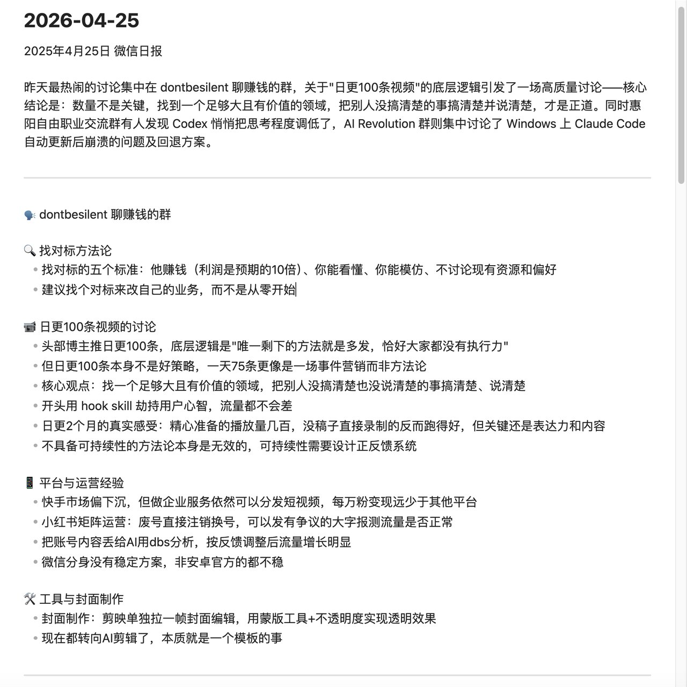
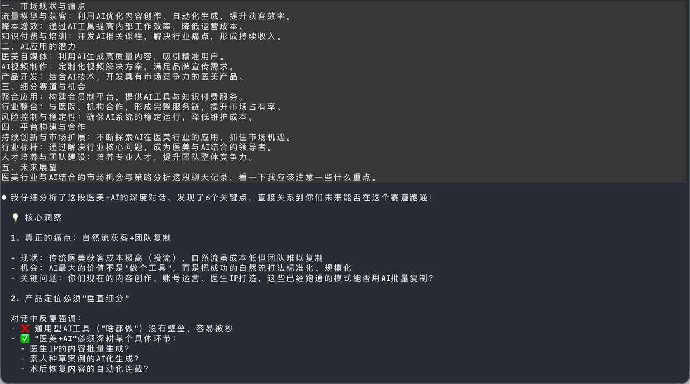
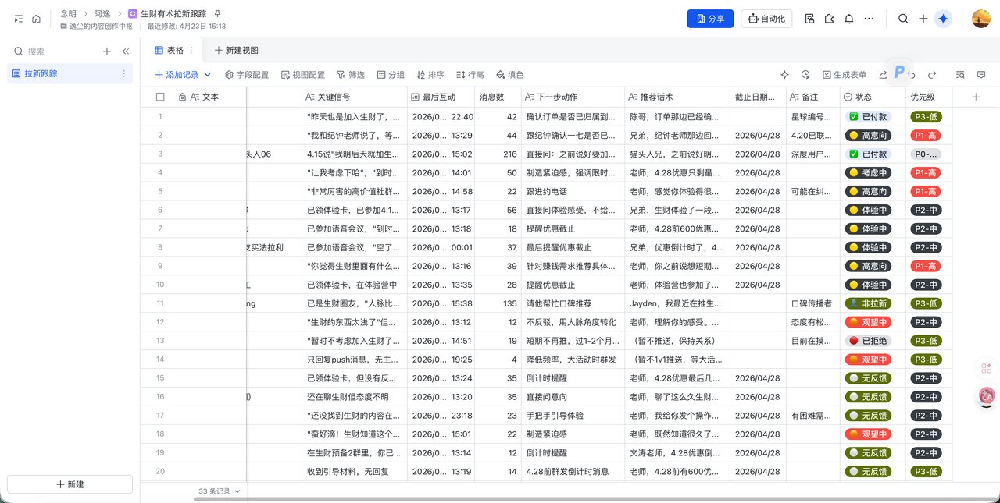
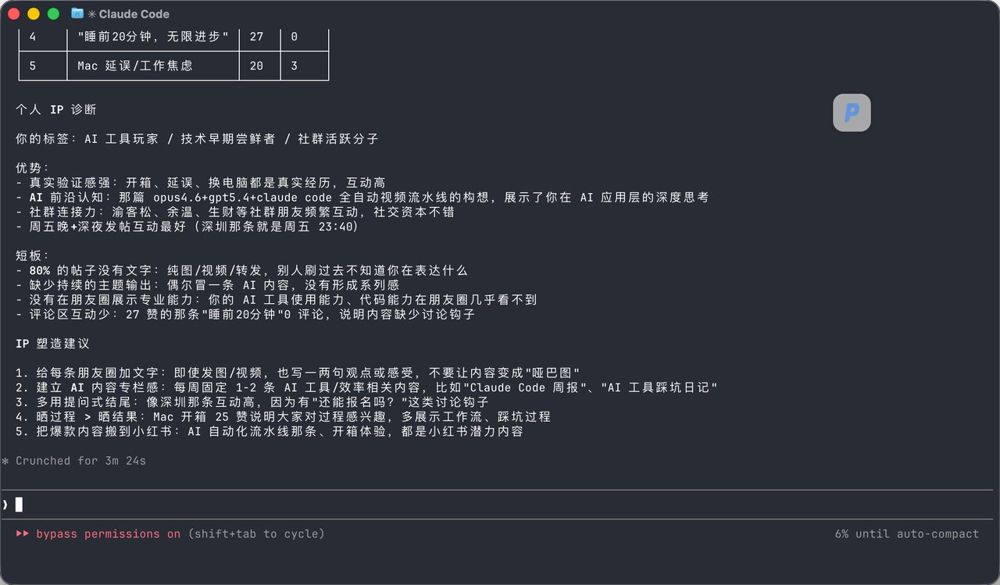

# Codex+GPT5.5实现微信双开Skill

## 正文

不是哥们，Codex App配合GPT5.5和Image2也太强了吧！这两天搞微信双开，一次性帮我搞定，还直接给我用Image2生成了一个蓝色的图标！

微信双开Skill：
https://
github.com/mcncarl/yichen
-skills/tree/main/mac-wechat-dual-open
…
引用
4月28日
https://
github.com/mcncarl/yichen
-skills/tree/main/wechat-daily
…上次我开源的这个Skill，把微信聊天记录、朋友圈、收藏夹全部解密，已经冲到了100+star！

这次我又进行了史诗级别更新！融合了九种新的玩法！只需要安装一次Skill，之后全是复利！

现在你第一次安装好skill的时候，Claude Code会提醒你去体验一下这些玩法！

